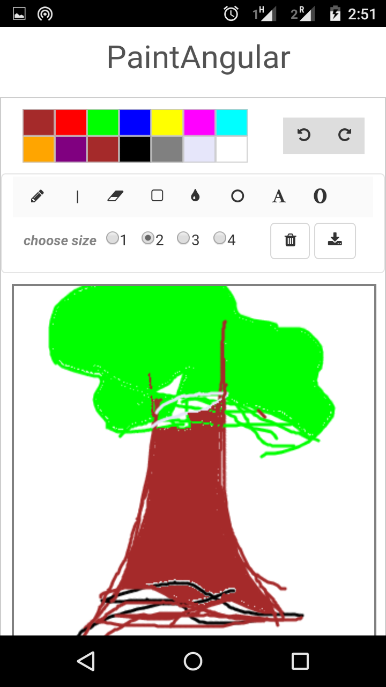
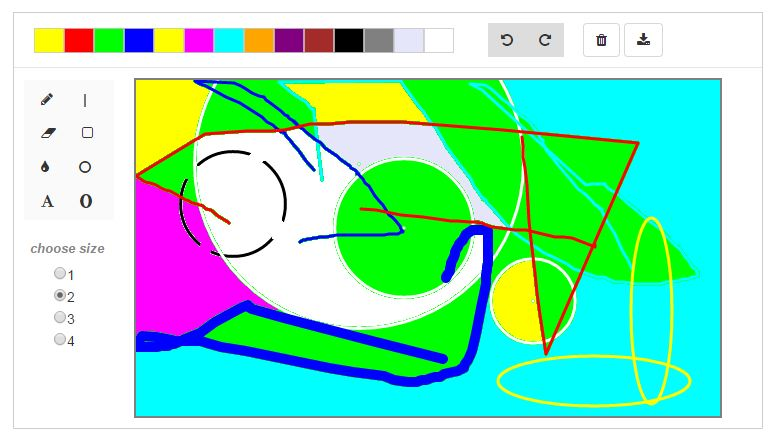

# PaintAngular
HTML5 Canvas based paint application as an angularjs directive

see demo: (http://cslab.org/paint)

Related project: (https://github.com/bnjasim/paint-application-javascript)

Requirements:
1. Twitter Bootstrap
2. AngularJS
3. Canvs HTML5 supported browser (check: http://caniuse.com/#feat=canvas)

Mobile support

Desktop support

